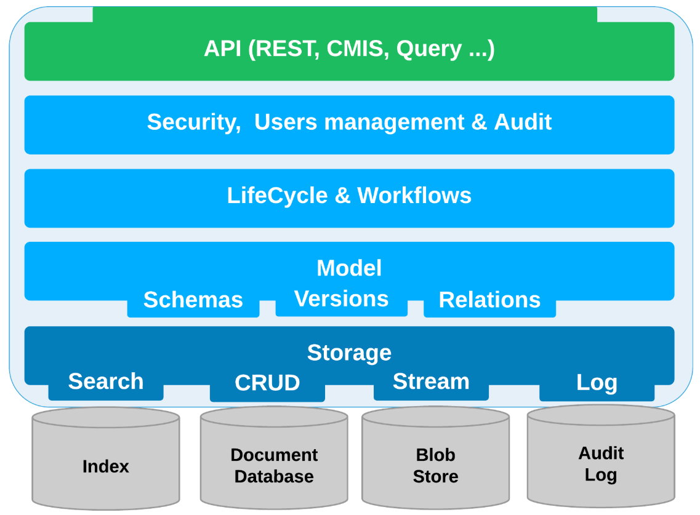
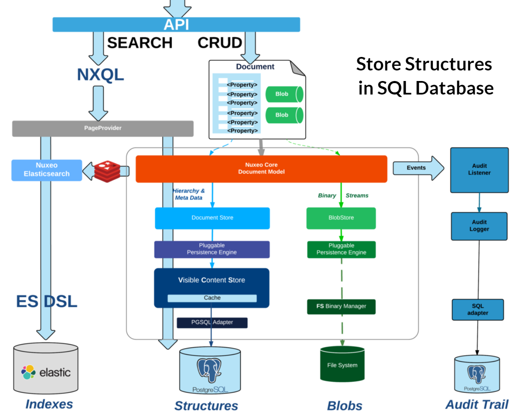
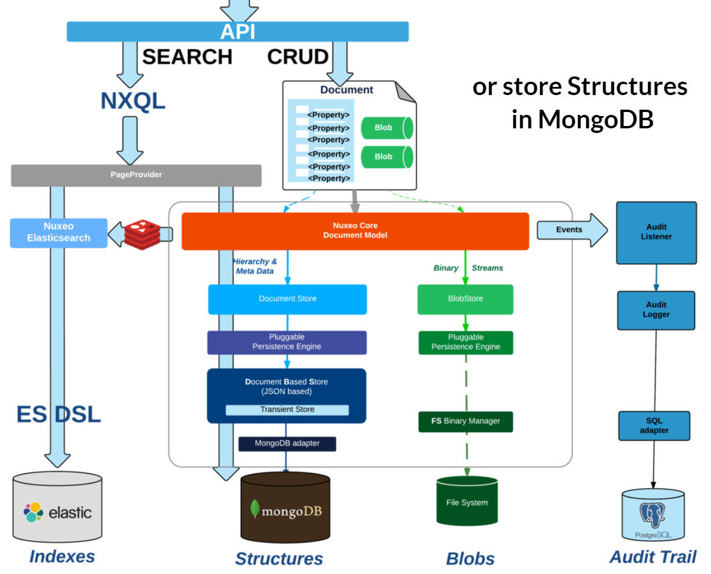

## 1.
This is an example of a very simplified insurance sales system made in a [`microservice architecture`](https://github.com/asc-lab/dotnetcore-microservices-poc) using:

- .NET Core 2.1
- Entity Framework Core
- MediatR
- Marten
- Eureka
- Ocelot
- JWT Tokens
- RestEase
- RawRabbit
- NHibernate
- Polly
- NEST (ElasticSearch client)
- Dapper
- DynamicExpresso

## 2.

Storing objects (think{JSON}object)

- Schemas - Custom Domain Model
- Streams - Conversions & Previews
- Security - Security Policies
- Search - on any field
- Audit  - Application Log (save audit trail in PostgreSQL)

### Repository & Storage Adapters

- File System also can be save in S3 (S3 Binary Manager)
- Google Drive & Google Doc integration

- Search - elastic
- Storage/Import - MongoDB
- Aync processing - Redis

## Search

- Simple search
- Faceted search
- Listings and views
- Suggestion widgets

## Elastic + MonogoDB / Redis

- elasticsearch
- redis
- Ecosystem:
> Cluster + MongoDB ReplicSet + ElasticSearch + Redis + Kafka + Zookeeper

Offload queries from DB - decouple sizing of searching & storage
performance & scalability

## Kafka + Redis

- QUeue Messages/Actions instead of Jobs
- Minimize redis persistence
- Optimize processing
  * pre-process messages (Audit)
  * regroup/batch some updates
