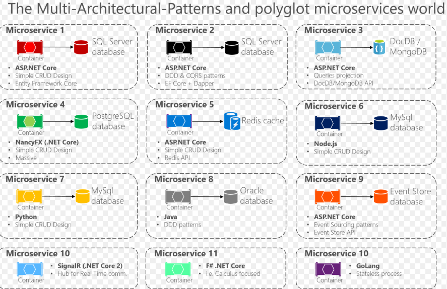

# Github Radar

We are experiencing `Kanban` development, with the from [`Technical Radar`](https://contribute.epam.com/products/123) project in EPAM's contribute site. 

# Frontend

## 1. GraphQL

### 1.1 What is GraphQL

GraphQL is a query language for APIs and a runtime for fulfilling those queries with your existing data. `Github developer community` has switched to `GrahQL` as their latest `github APIs` (v4).

### 1.2 Why GihHub is using GraphQL

Accoring to [`developer github`](https://developer.github.com/v4/):  
> It offers significantly more flexibility for our integrators. The ability to define precisely the data you want—and only the data you want—is a powerful advantage over the REST API v3 endpoints. GraphQL lets you replace multiple REST requests with a single call to fetch the data you specify.

### 1.3 Characteristics

### 1.4 Ecosystem

## 2. d3 and charts

## 3. React stack package

We bring together with react the hot and popular modules:

- redux
- react-router-dom
- redux-form

Besides, for responsive design, we use de-facto front-end CSS component library `twitter bootstrap`  most popular.

# Backend

## 1. Microservices

### 1.1 What is microservices?

Microservices - also known as the microservice architecture - is an architectural style that structures an application as a collection of services that are

### 1.2 Characteristics 

- micro-web-services, decouple, Multiple Components
- granular services
- Decentralized
- Linguistic approach, languages independency,  Jolie
- sharing, docker, container, distributed, Spring Framework, Spring Boot, Spring Cloud
- Eclipse MicroProfile: The Eclipse Foundation has published a specification for developing microservices

| service | git repository | description |
| -- | -- | -- |
| /api/github/v1/search/:keyword | https://gitcn.epam.com:4443/search.git | Rest API search call |
| /api/github/v1/users/:user | https://gitcn.epam.com:4443/user.git | Rest API user call |
| stream processing and analysis | https://gitcn.epam.com:4443/analysis.git | Stream Processing Analysis |

### 1.3 Benefits

- Highly maintainable and testable
- Loosely coupled
- Independently deployable
- Organized around business capabilities.
- Simpler to Deploy
- Simpler to Understand
- Reusability Across Business
- Faster Defect Isolation
- Minimized Risk Of Change

### 1.4 Concerns

- Configuration Management
- Service Discovery
- Load Balancing
- API Gateway: The granularity of APIs provided by microservices is often different than what a service client needs. API Gateways implement facades and provide additional services like proxying, and protocol translation, and other management functions.
- Security Concerns: Istio
- Centralized Logging
- Centralized Metrics
- Distributed Tracing
- Resilience & Fault Tolerance
- Autoscaling & Self-healing
- Packaging, Deployment, & Scheduling
- Job Management 
- Singleton Application

### 1.5 Ecosystem

Netflix, eBay, Amazon, Twitter, PayPal, and other tech stars have all evolved from `monolithic` to microservices architecture.

### 1.6 Trends

> Microservices -> Docker -> Kubernetes

## 2. Data Analysis, Kafka, Spark

### What is Kafka
Apache Kafka® is a distributed streaming platform.

### What is Spark

## Service

- PaaS: Platform as a Service
> Platform as a Service (PaaS) or Application Platform as a Service (aPaaS) or platform-based service is a category of cloud computing services that provides a platform allowing customers to develop, run, and manage applications without the complexity of building and maintaining the infrastructure typically associated with developing and launching an app.

Paas & Containers:
> Docker, Rancher, Openshift, Kuburnetes
> MongoDB + ElasticSearch + Redis + Kafka: NoSQL for a Scalable Content Repository

## Cloud

- Azure
- AWS
- GCP (google cloud platform)

## Reference

- [wiki Microservices](https://en.wikipedia.org/wiki/Microservices)
- [The Microservices world in .NET Core and .NET Framework](https://www.slideshare.net/massimobonanni/the-microservices-world-in-net-core-and-net-framework) - PPT
- [.NET Architecture](https://dotnet.microsoft.com/learn/dotnet/architecture-guides)
- pattern (language/solution), 
    * microservices architecuture 
    * monolithic application
    * acid transactions
    * distributed transaction = saga

coarse-grained - fine-grained
 
